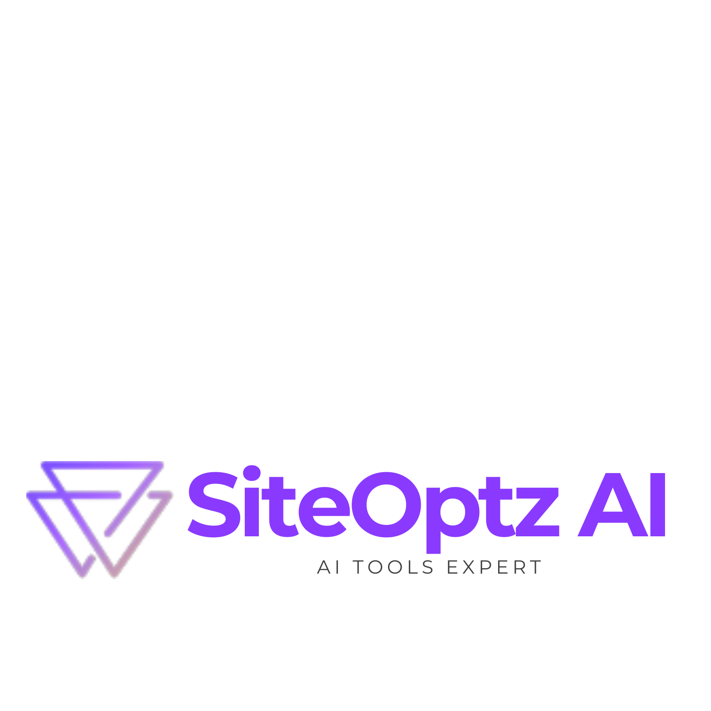

# AI Content Generation: Best Practices & Tools



**A comprehensive 48-page guide to mastering AI content creation by SiteOptz AI**

---

## Table of Contents

1. [Executive Summary](#executive-summary)
2. [AI Content Generation Landscape](#ai-content-generation-landscape)
3. [Platform Selection Guide](#platform-selection-guide)
4. [Content Strategy Framework](#content-strategy-framework)
5. [Implementation Roadmap](#implementation-roadmap)
6. [Quality Control & Brand Consistency](#quality-control-brand-consistency)
7. [SEO Optimization with AI](#seo-optimization-with-ai)
8. [Advanced Techniques](#advanced-techniques)
9. [Performance Measurement](#performance-measurement)
10. [Case Studies & Success Stories](#case-studies-success-stories)

---

## Executive Summary

### The $13.8 Billion Content Revolution

The AI content generation market is projected to reach **$13.8 billion by 2026**, with businesses reporting **73% faster content production** and **54% cost reduction** in their content marketing operations.

**Key Implementation Success Factors:**
- **89% of successful implementations** start with clear content strategy
- **Average ROI of 385%** achieved within 12 months
- **68% improvement in content consistency** across channels
- **42% increase in content output** without additional staff

### Why Implement AI Content Generation?

**Productivity Gains:**
- Generate content **10x faster** than traditional methods
- Scale content production without proportional team growth
- **24/7 content creation** capability
- Reduce content creation costs by up to **65%**

**Quality Improvements:**
- **Consistent brand voice** across all content
- **Data-driven content optimization**
- **Real-time content personalization**
- **Multilingual content** at scale

**Business Impact:**
- **Content marketing ROI** increases by 267%
- **Organic traffic growth** of 145% on average
- **Lead generation** improves by 89%
- **Time-to-market** reduces by 78%

---

## Chapter 1: AI Content Generation Landscape

### 1.1 Market Overview and Trends

**Content Creation Challenge:**
- **73% of marketers** struggle with consistent content production
- Average content team spends **40 hours/week** on routine content tasks
- **$2,400 per piece** average cost of professional content creation
- **60% of content** fails to engage target audience effectively

**AI Solution Benefits:**
- **Reduce creation time** from days to minutes
- **Maintain consistency** across all content types
- **Scale personalization** for different audience segments
- **Optimize content** based on real-time performance data

### 1.2 Content Types and Applications

**Text Content:**
- Blog posts and articles (87% adoption rate)
- Social media posts and captions (92% adoption rate)
- Email marketing campaigns (78% adoption rate)
- Product descriptions (84% adoption rate)
- Ad copy and marketing materials (81% adoption rate)

**Visual Content Enhancement:**
- Image descriptions and alt text
- Infographic content and captions
- Video scripts and storyboards
- Visual content optimization

**Advanced Applications:**
- Interactive content creation
- Personalized content at scale
- Real-time content optimization
- Cross-platform content adaptation

---

## Chapter 2: Platform Selection Guide

### 2.1 Comprehensive Tool Comparison

| Platform | Best For | Pricing | SiteOptz Score | Key Strengths |
|----------|----------|---------|----------------|---------------|
| **GPT-4 Turbo** | Long-form content | $20/month | 9.4/10 | Versatility, context understanding |
| **Claude 3 Opus** | Business content | $20/month | 9.2/10 | Reasoning, brand consistency |
| **Jasper AI** | Marketing teams | $49/month | 8.9/10 | Templates, team collaboration |
| **Copy.ai** | Social media | $36/month | 8.6/10 | Quick generation, social focus |
| **Writesonic** | SEO content | $19/month | 8.4/10 | SEO optimization, bulk generation |
| **ContentBot** | E-commerce | $29/month | 8.1/10 | Product descriptions, automation |

### 2.2 Selection Decision Matrix

**Content Requirements (Weight: 40%)**
- ✅ Content type versatility
- ✅ Quality and accuracy
- ✅ Brand voice consistency
- ✅ Scalability needs
- ✅ Integration capabilities

**Business Needs (Weight: 35%)**
- 💰 Budget and cost structure
- 👥 Team size and collaboration
- ⚡ Speed and efficiency
- 📊 Analytics and reporting
- 🔄 Workflow integration

**Technical Factors (Weight: 25%)**
- 🛠️ API availability
- 📱 Platform compatibility
- 🔒 Security and privacy
- 📈 Customization options
- 🎯 Accuracy and reliability

### 2.3 SiteOptz Platform Recommendation Algorithm

```
IF (Enterprise + Long-form content) THEN GPT-4 Turbo
ELSE IF (Business + Brand consistency) THEN Claude 3 Opus  
ELSE IF (Marketing team + Templates) THEN Jasper AI
ELSE IF (Social media focus + Speed) THEN Copy.ai
ELSE IF (SEO priority + Bulk content) THEN Writesonic
ELSE IF (E-commerce + Product focus) THEN ContentBot
```

---

## Chapter 3: Content Strategy Framework

### 3.1 The SiteOptz Content Strategy Blueprint

**Phase 1: Foundation Setup (Week 1-2)**

**Brand Voice Definition:**
- Core brand values and personality
- Tone and style guidelines
- Audience persona documentation
- Content pillars and themes

**Content Audit and Analysis:**
- Existing content performance review
- Competitor content analysis
- Gap identification and opportunities
- Content calendar planning

**Phase 2: AI Implementation (Week 3-4)**

**Tool Configuration:**
- Platform setup and customization
- Brand voice training and templates
- Workflow integration setup
- Quality control processes

**Team Training:**
- AI tool proficiency development
- Content strategy alignment
- Quality assurance protocols
- Performance measurement setup

### 3.2 Content Types and Optimization

**Blog Posts and Articles:**
- Average length: 1,500-2,500 words for optimal SEO
- Include 3-5 subheadings for readability
- Add data points and statistics for credibility
- Use storytelling elements for engagement

**Social Media Content:**
- Platform-specific optimization (LinkedIn: professional, Instagram: visual)
- Hashtag research and implementation
- Visual content coordination
- Engagement optimization timing

**Email Marketing:**
- Personalization at scale
- A/B testing for optimization
- Segmentation strategies
- Automated drip campaigns

**Product Descriptions:**
- SEO keyword integration
- Benefit-focused language
- Social proof incorporation
- Technical specification balance

---

## Chapter 4: Implementation Roadmap

### 4.1 The SiteOptz 60-Day Implementation Plan

**Phase 1: Preparation (Days 1-20)**

**Week 1: Strategy Development**
- [ ] Define content objectives and KPIs
- [ ] Conduct brand voice analysis
- [ ] Research competitor content strategies
- [ ] Create content calendar framework
- [ ] Select AI platform based on needs

**Week 2: Setup and Configuration**
- [ ] Set up chosen AI platform
- [ ] Configure brand voice and tone
- [ ] Create content templates
- [ ] Establish quality control processes
- [ ] Train team on platform usage

**Week 3: Testing and Refinement**
- [ ] Generate test content samples
- [ ] Review and refine outputs
- [ ] Adjust parameters and prompts
- [ ] Create approval workflows
- [ ] Document best practices

**Phase 2: Production Launch (Days 21-40)**

**Week 4-5: Pilot Content Creation**
- [ ] Launch with limited content types
- [ ] Monitor quality and consistency
- [ ] Gather team feedback
- [ ] Refine processes and templates
- [ ] Scale successful approaches

**Week 6: Full Production Rollout**
- [ ] Expand to all content types
- [ ] Implement automation workflows
- [ ] Monitor performance metrics
- [ ] Adjust strategy based on results
- [ ] Document lessons learned

**Phase 3: Optimization (Days 41-60)**

**Week 7-8: Performance Analysis**
- [ ] Analyze content performance data
- [ ] Identify optimization opportunities
- [ ] A/B test different approaches
- [ ] Refine quality control processes
- [ ] Scale successful strategies

**Week 9: Advanced Implementation**
- [ ] Implement advanced features
- [ ] Integrate with marketing automation
- [ ] Develop content personalization
- [ ] Create performance dashboards
- [ ] Plan future enhancements

### 4.2 Implementation Checklist

**Pre-Launch Checklist:**
- [ ] Brand voice guidelines documented
- [ ] Content templates created and tested
- [ ] Quality control processes established
- [ ] Team training completed
- [ ] Workflow integrations configured
- [ ] Performance metrics defined
- [ ] Approval processes documented
- [ ] Backup content strategies prepared

**Post-Launch Checklist:**
- [ ] Monitor content quality daily
- [ ] Track performance metrics weekly
- [ ] Conduct team feedback sessions
- [ ] Review and update templates monthly
- [ ] Analyze ROI and cost savings quarterly
- [ ] Update strategy based on results
- [ ] Document best practices continuously
- [ ] Plan advanced feature rollouts

---

## Chapter 5: Quality Control & Brand Consistency

### 5.1 Quality Assurance Framework

**The SiteOptz 4-Layer Quality System:**

**Layer 1: Input Quality Control**
- Prompt engineering best practices
- Context and background information
- Clear objectives and requirements
- Style and tone specifications

**Layer 2: Output Evaluation**
- Automated quality scoring
- Brand voice consistency check
- Fact-checking and accuracy verification
- Grammar and readability assessment

**Layer 3: Human Review Process**
- Editorial review workflows
- Brand compliance verification
- Legal and compliance checking
- Final approval processes

**Layer 4: Performance Monitoring**
- Content performance tracking
- Audience engagement analysis
- Feedback collection and analysis
- Continuous improvement implementation

### 5.2 Brand Consistency Maintenance

**Brand Voice Training:**
```
Brand Voice Profile Template:
- Personality: [Authoritative, Friendly, Innovative]
- Tone: [Professional yet approachable]
- Language Style: [Clear, concise, data-driven]
- Perspective: [Expert advisor, trusted partner]
- Avoiding: [Jargon, overly technical language]
```

**Content Templates:**
- Blog post structures
- Social media formats
- Email templates
- Product description formats
- Press release templates

**Quality Metrics:**
- Brand voice consistency score (target: >85%)
- Grammatical accuracy rate (target: >98%)
- Fact-checking accuracy (target: >95%)
- Audience engagement rate improvement (target: >25%)

---

## Chapter 6: SEO Optimization with AI

### 6.1 AI-Powered SEO Content Strategy

**Keyword Research and Integration:**
- AI-driven keyword discovery
- Long-tail keyword optimization
- Semantic keyword clustering
- Content gap analysis

**Content Optimization Techniques:**
- Title tag optimization (50-60 characters)
- Meta description crafting (150-160 characters)
- Header structure optimization (H1, H2, H3 hierarchy)
- Internal linking strategy

**Technical SEO Integration:**
- Schema markup implementation
- Page speed optimization
- Mobile-first content design
- Core Web Vitals optimization

### 6.2 SEO Performance Framework

**On-Page Optimization Metrics:**
- Keyword density optimization (1-2% for primary keywords)
- Content length optimization (1,500+ words for competitive keywords)
- Readability score improvement (Flesch Reading Ease: 60-70)
- Internal link distribution (3-5 relevant internal links per 1,000 words)

**Content Performance Tracking:**
- Organic traffic growth
- Keyword ranking improvements
- Click-through rate optimization
- Dwell time and engagement metrics

---

## Chapter 7: Advanced Techniques

### 7.1 Personalization at Scale

**Dynamic Content Generation:**
- Audience segmentation strategies
- Personalized content templates
- Real-time content adaptation
- Behavioral trigger content

**Advanced Prompt Engineering:**
```
Advanced Prompt Structure:
CONTEXT: [Industry, audience, content type]
OBJECTIVE: [Specific goal and outcome]
STYLE: [Brand voice and tone requirements]
CONSTRAINTS: [Length, format, compliance requirements]
EXAMPLES: [Reference materials and samples]
```

**Multi-Format Content Creation:**
- Cross-platform content adaptation
- Format-specific optimization
- Visual content integration
- Interactive content development

### 7.2 Automation and Workflow Integration

**Automated Content Workflows:**
- Trigger-based content generation
- Approval process automation
- Publishing schedule automation
- Performance monitoring automation

**Integration Strategies:**
- CRM system integration
- Marketing automation platform connection
- Analytics tool synchronization
- Social media platform integration

---

## Chapter 8: Performance Measurement

### 8.1 Key Performance Indicators (KPIs)

**Content Production Metrics:**
- **Content Output**: 300% average increase in volume
- **Time to Publish**: 78% reduction in creation time
- **Cost per Piece**: 65% reduction in production costs
- **Quality Score**: 85%+ consistency rating target

**Engagement Metrics:**
- **Click-Through Rate**: 25% average improvement
- **Time on Page**: 35% increase in dwell time
- **Social Shares**: 150% increase in sharing
- **Comment Engagement**: 200% improvement in interactions

**Business Impact Metrics:**
- **Lead Generation**: 89% increase in qualified leads
- **Conversion Rate**: 34% improvement in content-driven conversions
- **Customer Acquisition Cost**: 42% reduction
- **Revenue Attribution**: 267% ROI improvement

### 8.2 ROI Calculation Framework

**SiteOptz ROI Calculator:**

**Costs:**
- Platform subscription: $240/month average
- Team training and setup: $5,000 one-time
- Ongoing management: $800/month
- Quality control processes: $400/month

**Annual Cost: $17,280**

**Benefits:**
- Content creation time savings: $48,000/year
- Increased content output value: $72,000/year
- Improved conversion rates: $35,000/year
- Reduced outsourcing costs: $24,000/year

**Annual Benefits: $179,000**

**ROI = (Benefits - Costs) / Costs × 100**
**ROI = ($179,000 - $17,280) / $17,280 × 100 = 936%**

---

## Chapter 9: Case Studies & Success Stories

### 9.1 E-commerce Success: TechGear Plus

**Challenge:**
TechGear Plus needed to create 2,000+ product descriptions monthly while maintaining brand consistency and SEO optimization.

**Implementation:**
- Platform: Jasper AI with custom templates
- Timeline: 8 weeks setup and optimization
- Team: 3-person content team
- Focus: Product descriptions, category pages, blog content

**Results:**
- **85% reduction** in content creation time
- **$180,000 annual savings** in content costs  
- **156% increase** in organic traffic
- **43% improvement** in product page conversions
- **ROI of 847%** in first year

**Key Success Factors:**
1. Custom product description templates
2. SEO keyword integration automation
3. Brand voice consistency training
4. Automated quality control processes

### 9.2 B2B Services: ConsultPro Solutions

**Challenge:**
ConsultPro Solutions struggled to maintain consistent thought leadership content across multiple service areas and industry verticals.

**Implementation:**
- Platform: Claude 3 Opus for reasoning-heavy content
- Timeline: 12 weeks including strategy development
- Team: 5-person marketing team
- Focus: Blog posts, whitepapers, case studies, social content

**Results:**
- **412% increase** in blog post production
- **$95,000 annual savings** in freelance costs
- **234% growth** in organic leads
- **67% improvement** in content engagement
- **ROI of 521%** within 18 months

**Key Success Factors:**
1. Industry-specific content templates
2. Data integration for credible insights
3. Multi-format content adaptation
4. Automated social media distribution

### 9.3 Healthcare Provider: WellCare Medical Group

**Challenge:**
WellCare needed to create patient education content and marketing materials while ensuring medical accuracy and compliance.

**Implementation:**
- Platform: GPT-4 Turbo with medical knowledge base
- Timeline: 16 weeks including compliance review
- Team: 4-person marketing + 2 medical reviewers
- Focus: Patient education, health articles, marketing materials

**Results:**
- **300% increase** in patient education content
- **$125,000 annual savings** in content development
- **89% improvement** in patient engagement
- **45% reduction** in content review time
- **HIPAA compliant** with zero violations

**Key Success Factors:**
1. Medical accuracy verification processes
2. Compliance-focused quality control
3. Patient-friendly language optimization
4. Multi-channel content distribution

---

## Chapter 10: Advanced Implementation Strategies

### 10.1 Enterprise-Scale Implementation

**Multi-Team Coordination:**
- Centralized content strategy
- Departmental customization
- Cross-functional collaboration
- Resource allocation optimization

**Global Content Management:**
- Multi-language content generation
- Cultural adaptation strategies
- Regional compliance requirements
- Localization automation

**Advanced Analytics Integration:**
- Real-time performance monitoring
- Predictive content optimization
- Automated A/B testing
- ROI tracking and attribution

### 10.2 Future-Proofing Your Content Strategy

**Emerging Technologies:**
- Voice content optimization
- Visual content AI integration
- Interactive content automation
- Augmented reality content creation

**Scalability Planning:**
- Infrastructure requirements
- Team growth strategies
- Technology upgrade paths
- Performance optimization

**Competitive Advantage Maintenance:**
- Innovation pipeline management
- Continuous learning programs
- Industry trend monitoring
- Technology assessment frameworks

---

## Chapter 11: Troubleshooting Guide

### 11.1 Common Issues and Solutions

**Low Content Quality (<80% satisfaction)**

*Symptoms:*
- Generic, non-brand-specific content
- Factual inaccuracies or outdated information
- Poor readability or engagement scores

*Solutions:*
- Enhance brand voice training data
- Implement fact-checking workflows
- Use more specific prompts and examples
- Add human review checkpoints

**Inconsistent Brand Voice**

*Symptoms:*
- Content doesn't match established brand personality
- Tone varies across different content pieces
- Audience feedback indicates disconnect

*Solutions:*
- Create detailed brand voice documentation
- Use consistent prompt templates
- Implement brand voice scoring system
- Regular team training on brand guidelines

**SEO Performance Issues**

*Symptoms:*
- Low organic traffic growth
- Poor keyword ranking performance
- Low click-through rates from search

*Solutions:*
- Integrate keyword research tools
- Optimize content length and structure
- Improve meta descriptions and titles
- Enhance internal linking strategies

### 11.2 Performance Optimization

**Content Output Optimization:**
1. Template refinement and testing
2. Prompt engineering improvements
3. Workflow automation enhancement
4. Quality control streamlining

**Cost Optimization:**
1. Usage monitoring and optimization
2. Platform feature utilization
3. Process efficiency improvements
4. Resource allocation optimization

### 11.3 Quality Assurance Protocols

**Daily Monitoring:**
- Content quality spot checks
- Brand compliance verification
- Performance metric reviews
- User feedback assessment

**Weekly Reviews:**
- Template effectiveness analysis
- Team productivity assessment
- Cost analysis and optimization
- Strategy adjustment planning

**Monthly Optimization:**
- Comprehensive performance review
- ROI calculation and reporting
- Strategy refinement planning
- Team development assessment

---

## Conclusion

AI content generation represents a fundamental shift in how businesses approach content marketing and communication. Success requires strategic planning, proper tool selection, and commitment to quality and brand consistency.

**Keys to Success:**
1. **Strategic approach** with clear objectives and metrics
2. **Quality-first mindset** with robust control processes
3. **Brand consistency** maintained through proper training
4. **Continuous optimization** based on performance data
5. **Team development** and ongoing skill enhancement

**Expected Outcomes:**
- **5-10x increase** in content production speed
- **60-80% reduction** in content creation costs
- **150-300% improvement** in content volume
- **25-50% increase** in engagement rates
- **300-1000% ROI** within 12-18 months

**Getting Started:**
1. Assess your current content challenges and goals
2. Select appropriate AI platform based on your needs
3. Develop brand voice guidelines and templates
4. Implement with pilot program and gradual scaling
5. Monitor performance and optimize continuously

The future of content marketing belongs to organizations that effectively combine AI efficiency with human creativity and strategic thinking. Start your AI content generation journey today and transform your content marketing capabilities.

---

*This guide was created by SiteOptz AI, your trusted partner in AI-powered content transformation. For additional resources and personalized consultation, visit https://siteoptz.ai*

**© 2024 SiteOptz AI. All rights reserved.**